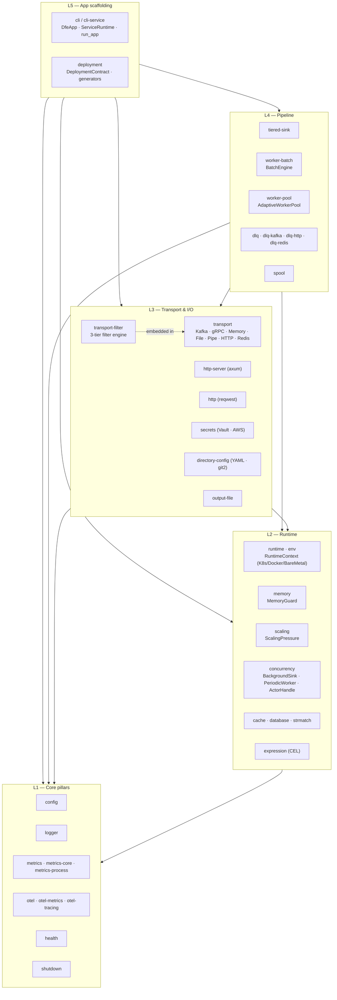

# Architecture

The crate is organised in five layers. Code in a higher layer can depend on
lower layers but never the other way round. Most modules are feature-gated
so consumers only pay for what they wire in.

Dashed line = `transport-filter` is embedded inside every transport
backend, not a separate caller. Solid arrows show layer dependencies.

---

## Module map

### L1 — Core pillars (always-on, auto-wired)

| Module | Feature | Purpose |
|--------|---------|---------|
| `config` | `config` (default) | 8-layer cascade (CLI → env → .env → YAML → defaults), hot-reload, section registry, `/config` admin endpoint |
| `logger` | `logger` (default) | `tracing-subscriber` with JSON/text autodetect, RFC 3339 timestamps, sensitive-field masking, flood-control helpers |
| `metrics` | `metrics-core`, `metrics-process`, `metrics` | Lock-free counters/gauges/histograms, Prometheus exporter, `/metrics` + `/metrics/manifest` |
| `otel_metrics` / `otel_tracing` | `otel`, `otel-metrics`, `otel-tracing` | OTLP exporter, OTel SDK bridge for `tracing` spans |
| `health` | `health` | `HealthRegistry`, probe trinity (`/healthz` / `/readyz` / `/startupz`) |
| `shutdown` | `shutdown` | `CancellationToken`, SIGTERM/SIGINT, K8s pre-stop delay |

Pillars are singletons. Modules in higher layers call into them via macros
(`tracing::info!`, `metrics::counter!`) or global getters
(`config::get`). No handle passing.

### L2 — Runtime

| Module | Feature | Purpose |
|--------|---------|---------|
| `env` | always | Detect environment (Kubernetes, Docker, container, bare metal) |
| `runtime` | `runtime` | XDG/container-aware paths, `RuntimeContext` singleton (pod, namespace, node, memory limit, CPU quota) |
| `memory` | `memory` | `MemoryGuard` — cgroup-aware OOM prevention with auto-detected limits |
| `scaling` | `scaling` | `ScalingPressure` — KEDA external-scaler signal (0.0–100.0) |
| `concurrency` | `concurrency` | `BackgroundSink`, `PeriodicWorker`, `ActorHandle` — fire-and-forget, timer, command-queue primitives |
| `cache` | `cache` | Moka TinyLFU async cache |
| `database` | `database` | URL builders, connection-string helpers |
| `strmatch` | `strmatch` | 4-tier string matcher: `Byte`, `Literal`, `LiteralSet`, `Regex` |
| `expression` | `expression` | CEL evaluator (used by transport filters) |

### L3 — Transport & I/O

| Module | Feature | Purpose |
|--------|---------|---------|
| `transport` | `transport`, `transport-{kafka,grpc,memory,file,pipe,http,redis}` | Trait architecture (`TransportBase`, `TransportSender`, `TransportReceiver`, `Transport`), `AnySender` enum dispatch, factory |
| `transport::filter` | `transport` | 3-tier engine (SIMD field ops / compiled CEL / complex CEL) embedded in every backend |
| `http_server` | `http-server` | axum-based server, probe wiring, `/config` / `/metrics` / `/metrics/manifest` mount points |
| `http_client` | `http` | `reqwest` + `reqwest-middleware` + `reqwest-retry` |
| `secrets` | `secrets`, `secrets-vault`, `secrets-aws` | `SecretsManager` trait, OpenBao/Vault and AWS Secrets Manager backends |
| `directory_config` | `directory-config`, `directory-config-git` | YAML directory store with optional `git2` |
| `output` | `output-file` | NDJSON file output sink |

### L4 — Pipeline

| Module | Feature | Purpose |
|--------|---------|---------|
| `spool` | `spool` | Disk-backed async FIFO queue (`yaque` + `zstd`) |
| `tiered_sink` | `tiered-sink` | Transport + spool + circuit breaker + retry + DLQ fallback |
| `worker::pool` | `worker-pool` | `AdaptiveWorkerPool` (rayon + tokio), pressure-based scaling |
| `worker::engine` | `worker-batch` | `BatchEngine` — SIMD parse (`sonic-rs`), pre-route filter, field interning |
| `dlq` | `dlq`, `dlq-kafka`, `dlq-http`, `dlq-redis` | DLQ sink with file always available, Kafka/HTTP/Redis backends opt-in |

### L5 — App scaffolding

| Module | Feature | Purpose |
|--------|---------|---------|
| `cli` | `cli` | `clap` types: `CommonArgs`, `StandardCommand`, `VersionInfo`, output helpers |
| `cli::service` | `cli-service` | `DfeApp` trait, `run_app`, `ServiceRuntime` — full DFE app scaffolding |
| `top` | `top` | TUI metrics dashboard (`ratatui`) |
| `deployment` | `deployment`, `deployment-smoke` | `DeploymentContract`, generators for Dockerfile / Helm chart / ArgoCD Application / container manifest |
| `version_check` | `version-check` | Startup HTTP probe to the HyperI version API |

---

## Layering rules

1. **A module never depends upward.** `transport` cannot import from `cli`.
   `config` cannot import from `worker`. Cargo's feature graph enforces
   most of this; code review catches the rest.
2. **Pillars don't depend on each other beyond what's structurally
   required.** `metrics` uses `tracing` for its own logging, but does not
   know `config` exists.
3. **L2 modules can be used standalone.** `MemoryGuard`, `ScalingPressure`,
   `cache`, `strmatch` all work without the L4 pipeline above them.
4. **L3 transports always embed the filter engine.** Even when no filters
   are configured the engine is present as a no-op (a single
   `has_inbound_filters()` branch on every send/recv). Zero-cost when empty.
5. **L4 pipeline modules compose L3 transports with L2 runtime concerns.**
   `tiered_sink` is the canonical example: a transport plus spool plus
   memory pressure plus circuit breaker plus DLQ.
6. **L5 scaffolding glues the whole stack.** `ServiceRuntime::new` wires
   the pillars, runtime, pipeline primitives, and shutdown into one
   object the app holds. `DeploymentContract` does the same job for the
   "ship it" side: one struct, generates every artefact CI/CD needs.

---

## Feature defaults

- `default = ["config", "logger"]`. Nothing else. Apps explicitly opt in.
- The trim landed in 2.6.0 to shave ~200 transitive deps off the
  "I-just-want-config" use case.
- See [FEATURE-FLAGS.md](FEATURE-FLAGS.md) for the full tree and which
  features pull in which.

---

## Where the dependency graph gets non-obvious

A handful of dependencies aren't visible from layer naming alone:

- `worker-batch` depends on `worker-pool` (the engine sits on top of the
  pool), which in turn depends on `metrics` and `config`.
- `tiered-sink` is L4 but pulls `spool` (also L4) directly, plus an L3
  transport from outside its own crate.
- `dlq` requires `concurrency` (L2) for the `BackgroundSink` actor that
  drains queued entries.
- `transport-trace` is the *only* feature that pulls in the OpenTelemetry
  SDK on the transport side. Apps that send/receive without distributed
  tracing avoid that dep entirely.
- `cli-service` (L5) reaches across the whole stack — it pulls
  `metrics + memory + scaling + worker-pool + shutdown` because
  `ServiceRuntime::new` wires all of them.

Read [FEATURE-FLAGS.md](FEATURE-FLAGS.md) for the full feature-to-feature
edges and [AUTO-WIRING.md](AUTO-WIRING.md) for which dependencies are
auto-wired vs explicit.

---

## Project facts

- **Edition:** 2024
- **MSRV:** 1.95
- **Sibling lib:** `hyperi-pylib` (Python equivalent)
- **Downstream:** the six core DFE apps consume `hyperi-rustlib` in
  lockstep (see [README.md § Project facts](README.md#project-facts))
