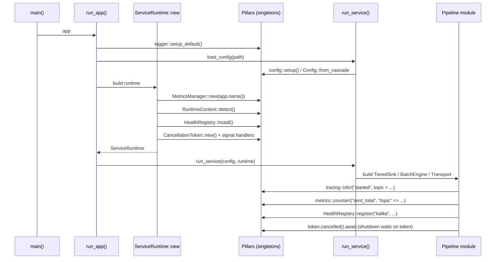

# Auto-wiring

The rule across the crate: **modules talk to each other through global
singletons, not handle passing**. Wire the singleton once at startup,
every module that needs it picks it up via a macro or a global getter.

This doc is the model — what's wired, how, and what the consequences are.

---

## The singletons

| Pillar | Singleton mechanism | Initialiser | Reader |
|--------|---------------------|-------------|--------|
| Config | `OnceLock<Config>` | `config::setup(opts)` | `config::get`, `T::from_cascade()`, `Config::unmarshal_key_registered` |
| Logger | Global `tracing` subscriber | `logger::setup_default()` | `tracing::info!`, `warn!`, `error!`, `debug!`, `trace!` macros |
| Metrics | Global `metrics` recorder | `MetricsManager::new("app")` | `metrics::counter!`, `gauge!`, `histogram!` macros |
| OTel | Global meter + tracer provider | `otel::setup()` (or via `otel-tracing` subscriber layer) | Propagated through `tracing::span!` and `#[instrument]` |
| Health | `HealthRegistry` | `HealthRegistry::register("module", ...)` | `/readyz` aggregates; `HealthState::current()` |
| Shutdown | `CancellationToken` (from `tokio-util`) | `ServiceRuntime::new` (or `shutdown::install_handlers()`) | `token.cancelled().await` in any task |
| Runtime context | `OnceLock<RuntimeContext>` | `RuntimeContext::detect()` (called by `ServiceRuntime`) | `RuntimeContext::current()` |

These are the only globals. Everything else passes handles or
borrows.

---

## The flow

The app never passes a `Logger` or `MetricsManager` into a module. The
module reaches into the singleton via a macro. This is intentional — it
means a `Transport` impl ships with metrics-emission baked in, and the
*same* `Transport` impl works in any app that's wired `MetricsManager`.

---

## What's auto-wired versus explicit

`ServiceRuntime::new` is the one-stop wire-up. It pulls in:

| Singleton | Action |
|-----------|--------|
| Logger | Already installed by `run_app` before `ServiceRuntime::new` runs |
| Config | Already loaded by `app.load_config` before `ServiceRuntime::new` runs |
| Metrics | `MetricsManager::new(app.name())` installed and running |
| Health | `HealthRegistry` initialised; modules `register` themselves later |
| Shutdown | `CancellationToken` created, SIGTERM/SIGINT handlers attached, K8s pre-stop delay configured |
| Runtime context | `RuntimeContext::detect()` runs once, results cached |
| Memory guard | `MemoryGuard` constructed if `memory` feature on |
| Scaling pressure | `ScalingPressure` built if `scaling` feature on, with `app.scaling_components(config)` |
| Worker pool | `AdaptiveWorkerPool` constructed if `worker-pool` feature on |
| HTTP server | Started if `http-server` feature on, mounting `/healthz` `/readyz` `/startupz` `/metrics` and (opt-in) `/config` `/metrics/manifest` |

What's **not** auto-wired and still requires an explicit call from the app:

- `TieredSink::new(...)` — you choose which transport, which spool, which DLQ
- `BatchEngine::process_*` — you choose the parsing strategy and the transform closure
- `Transport::from_config(...)` — you name the config section (`transport.output`, `transport.input`)
- Anything in `directory-config`, `secrets`, `cache`, `database` — these are tools you reach for when needed

Rule of thumb: the **pillars** auto-wire. The **L4 pipeline** modules
are tools you compose into your `run_service`.

---

## The "you get this for free" matrix

| You did this | You got this — no extra wiring |
|--------------|-------------------------------|
| `config::setup(opts)` | 8-layer cascade, env-var nesting, `.env`, sensitive masking, hot-reload, `/config` admin endpoint, section registry |
| `logger::setup_default()` | Structured tracing, JSON/text autodetect, RFC 3339 timestamps, masking, flood control |
| `MetricsManager::new("app")` | Prometheus exporter, `/metrics` endpoint, process metrics, cardinality cap, `/metrics/manifest` |
| `ServiceRuntime::new(...)` | All of the above + memory guard + scaling pressure + worker pool + shutdown token + K8s pre-stop + runtime context + HTTP server |
| Any `Transport` impl | 3-tier filter engine, DLQ routing, per-direction/action metrics, traceparent propagation |
| `TieredSink::new(...)` | Transport + spool + circuit breaker + retry + DLQ + backpressure signal |
| `BatchEngine::process_mid_tier()` | SIMD JSON parse, pre-route filter, field interning, parallel transform on the worker pool, commit-token plumbing |
| `DeploymentContract { ... }` | Dockerfile, Helm chart (with KEDA + secrets + values), ArgoCD Application, container manifest, metrics manifest, OCI labels |
| `HealthRegistry::register("module", ...)` | Module appears in `/readyz` aggregate; reports go through the same JSON shape every app uses |

Read each subsystem doc for the implementation detail behind a given
row.

---

## Why singletons

The alternative is constructor injection — pass a `Logger` to every
module that logs, a `MetricsManager` to every module that emits
counters, a `Config` to every module that reads config. That model
works in small services. It rots in a 50-module crate that ships into
six downstream apps because:

1. **Every new module forces a signature change** somewhere up the call
   stack to thread the handle through.
2. **Library code can't emit metrics without the consumer wiring it
   through.** A `Transport` impl that wants to emit `kafka_messages_total`
   needs the consumer to thread a `MetricsManager` through to it.
3. **Tests duplicate the wiring.** Every integration test stands up
   the same plumbing.
4. **It blocks orthogonal features.** A new module that wants to call
   `tracing::info!` requires a logger handle; with the singleton it's
   automatic.

The singleton model has the obvious failure mode: tests that run in
parallel race on installing the global. The two mitigations:

- **Test-only constructors**: `MetricsManager::new_for_test` skips
  `set_global_recorder`. The macros become no-ops; everything else
  (registry, descriptors, label validation) still runs.
- **Process-per-test runners**: `cargo nextest` runs each test in its
  own process. The global is fresh per test.

See [core-pillars/METRICS.md § Testing](core-pillars/METRICS.md#testing)
for the test pattern.

---

## What this looks like for a module author

When you add a new module to `hyperi-rustlib` (or to a downstream app
that has one), the auto-wiring contract is:

1. **If the module has configurable behaviour**, load via the cascade —
   `T::from_cascade()` or `Config::unmarshal_key_registered::<T>(...)`.
   Don't read env vars directly.
2. **If the module does I/O or processing**, add `#[cfg(feature = "metrics-core")]`
   counters/gauges/histograms via the macros. No handle passing.
3. **If the module can fail or has interesting state**, add
   `tracing::` log calls at the right level. No handle passing.
4. **If the module affects service readiness**, register into the
   `HealthRegistry`. Aggregated automatically into `/readyz`.
5. **If the module is long-lived**, take a `CancellationToken` argument
   (or grab it off the runtime) and select on it in your main loop.

Follow that contract and your module ships with full observability the
moment the consumer wires `MetricsManager::new` + `logger::setup_default`
+ `config::setup`. No extra plumbing.
