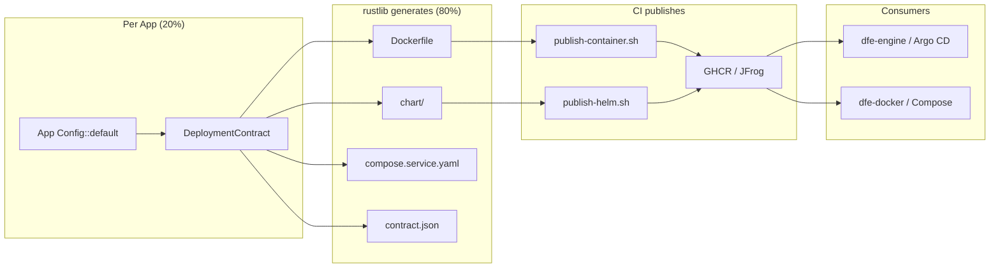

# Deployment Artifact Generation

The `deployment` module generates Kubernetes and Docker deployment artifacts
from a `DeploymentContract`. Apps provide ~20% customisation (ports, secrets,
config); rustlib generates ~80% boilerplate (Dockerfile, Helm chart, Compose
fragment).

---

## How It All Connects



## What Changes Where

| Component | Provides | Consumes |
|-----------|----------|----------|
| **rustlib** | `generate_dockerfile()`, `generate_chart()`, `generate_compose_fragment()` | `DeploymentContract` from app |
| **dfe-loader** | `DeploymentContract` (ports, secrets, config, KEDA thresholds) | Generated Dockerfile + chart/ |
| **dfe-receiver** | `DeploymentContract` (ports, secrets, config) | Generated Dockerfile + chart/ |
| **CI** (`publish-container.sh`) | Multi-arch container image | Dockerfile |
| **CI** (`publish-helm.sh`) | OCI Helm chart package | chart/ directory |
| **dfe-engine** | K8s deployment (Argo CD) | Helm chart from registry + env overlays |
| **dfe-docker** | Docker Compose stack | Published container images |

## DeploymentContract

The contract captures deployment-facing values derived from the app's
`Config::default()`. Validation functions compare existing artifacts against
these values; generation functions create artifacts from scratch.

```rust
let contract = DeploymentContract {
    app_name: "dfe-loader".into(),
    binary_name: "dfe-loader".into(),
    description: "High-performance Kafka to ClickHouse data loader".into(),
    metrics_port: 9090,
    health: HealthContract {
        liveness_path: "/healthz".into(),
        readiness_path: "/readyz".into(),
        metrics_path: "/metrics".into(),
    },
    env_prefix: "DFE_LOADER".into(),
    metric_prefix: "loader".into(),
    config_mount_path: "/etc/dfe/loader.yaml".into(),
    image_registry: "ghcr.io/hyperi-io".into(),
    extra_ports: vec![],
    entrypoint_args: vec!["--config".into(), "/etc/dfe/loader.yaml".into()],
    secrets: vec![
        SecretEnvContract {
            env_var: "DFE_LOADER__KAFKA__USERNAME".into(),
            secret_name_helper: "dfe-loader.kafkaSecretName".into(),
            secret_key: "kafka-username".into(),
        },
    ],
    default_config: None,
    depends_on: vec!["kafka".into(), "clickhouse".into()],
    keda: Some(KedaContract::default()),
};
```

### Fields

| Field | Required | Description |
|-------|----------|-------------|
| `app_name` | Yes | Application name, used in Chart.yaml `name` and labels |
| `binary_name` | Yes | Binary filename (usually same as app_name) |
| `description` | Yes | One-line description for Chart.yaml |
| `metrics_port` | Yes | Metrics/health listen port |
| `health` | Yes | Liveness, readiness, metrics endpoint paths |
| `env_prefix` | Yes | Environment variable prefix (figment cascade) |
| `metric_prefix` | Yes | Prometheus metric namespace |
| `config_mount_path` | Yes | Config file path in container |
| `image_registry` | Yes | Container registry base (e.g., `ghcr.io/hyperi-io`) |
| `extra_ports` | No | Additional ports beyond metrics (e.g., HTTP data port) |
| `entrypoint_args` | No | Default CMD args (e.g., `["--config", "/etc/dfe/loader.yaml"]`) |
| `secrets` | No | Secret env vars injected from K8s Secrets |
| `default_config` | No | App-specific config YAML for values.yaml |
| `depends_on` | No | Docker Compose service dependencies |
| `keda` | No | KEDA autoscaling contract |

## Generated Artifacts

### Dockerfile

```dockerfile
FROM debian:bookworm-slim

RUN apt-get update && apt-get install -y --no-install-recommends \
    ca-certificates curl netcat-openbsd iputils-ping \
    && rm -rf /var/lib/apt/lists/*

COPY {binary_name} /usr/local/bin/{binary_name}
RUN chmod +x /usr/local/bin/{binary_name}

RUN useradd --create-home --uid 1000 appuser
USER appuser

EXPOSE {metrics_port} {extra_ports...}

HEALTHCHECK --interval=30s --timeout=3s --start-period=5s --retries=3 \
    CMD curl -sf http://localhost:{metrics_port}{liveness_path} > /dev/null || exit 1

ENTRYPOINT ["{binary_name}"]
CMD {entrypoint_args}
```

### Helm Chart

`generate_chart()` writes a complete chart/ directory:

- `Chart.yaml` — name, description, appVersion
- `values.yaml` — ports, image, resources, KEDA config, secrets, app config
- `templates/_helpers.tpl` — standard name/label/serviceAccount helpers
- `templates/deployment.yaml` — container spec with probes, env from secrets, volume mounts
- `templates/service.yaml` — ClusterIP service for metrics + extra ports
- `templates/serviceaccount.yaml` — optional ServiceAccount
- `templates/configmap.yaml` — app config file from values
- `templates/secret.yaml` — optional secret creation (when not using existingSecret)
- `templates/hpa.yaml` — HPA fallback (when KEDA not installed)
- `templates/keda-scaledobject.yaml` — KEDA ScaledObject
- `templates/keda-triggerauth.yaml` — KEDA TriggerAuthentication
- `templates/NOTES.txt` — install notes

### Docker Compose Fragment

```yaml
services:
  dfe-loader:
    image: ghcr.io/hyperi-io/dfe-loader:${DFE_LOADER_VERSION:-latest}
    depends_on:
      kafka:
        condition: service_healthy
      clickhouse:
        condition: service_healthy
    ports:
      - "9090:9090"
    volumes:
      - ./config/loader.yaml:/etc/dfe/loader.yaml:ro
    healthcheck:
      test: ["CMD", "curl", "-sf", "http://localhost:9090/healthz"]
      interval: 10s
      timeout: 3s
      retries: 5
```

## Per-App Customisation (the 20%)

Each app provides a `DeploymentContract` builder in its config module:

```rust
impl LoaderConfig {
    pub fn deployment_contract() -> DeploymentContract {
        DeploymentContract {
            app_name: "dfe-loader".into(),
            // ... app-specific values
        }
    }
}
```

The remaining ~80% (Dockerfile structure, Helm template boilerplate, probe
wiring, KEDA integration, Compose patterns) is identical across all DFE apps
and generated by rustlib.

## Combined Container (Future)

For dfe-docker IPC mode, a combined container with multiple DFE services:

```dockerfile
# Multi-stage: extract binaries from published images
FROM ghcr.io/hyperi-io/dfe-receiver:latest AS receiver
FROM ghcr.io/hyperi-io/dfe-loader:latest AS loader

FROM debian:bookworm-slim
COPY --from=receiver /usr/local/bin/dfe-receiver /usr/local/bin/
COPY --from=loader /usr/local/bin/dfe-loader /usr/local/bin/
COPY entrypoint.sh /usr/local/bin/
ENTRYPOINT ["entrypoint.sh"]
```

With `entrypoint.sh` using bash trap for process supervision.

## Validation

Existing `validate_helm_values()` and `validate_dockerfile()` functions
continue to work — they compare artifacts (whether hand-written or generated)
against the contract. In CI tests, apps call both generation and validation
to ensure consistency.
