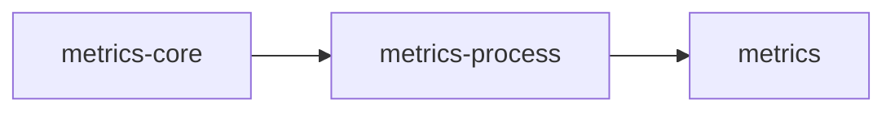
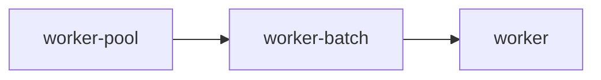
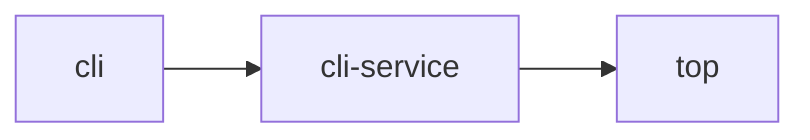

# Feature flags

`hyperi-rustlib` ships ~60 cargo features. The trim in 2.6.0 dropped
defaults to the minimum (`config`, `logger`) so the
"I-just-want-config" use case avoids ~200 transitive deps. Every other
feature is opt-in.

This doc covers:

- The default set and why it's minimal
- The feature tree (which feature pulls in which)
- Native-deps that come with certain features (apt packages on Linux)
- Recommended bundles for common app shapes

For the *what* — what a feature actually does — see the subsystem doc
linked in each row. This page is about which features to enable and what
that costs.

---

## Defaults

```toml
[dependencies.hyperi-rustlib]
version = ">=2.7, <3"
# default = ["config", "logger"]
```

That's it. The default set covers:

- 8-layer config cascade
- Structured logging via `tracing-subscriber`

If you only need those two, you can stop reading.

---

## Tier-split features (the not-so-obvious ones)

Several features ship in tiers so callers pay only for what they use.

### Metrics



| Feature | Adds |
|---------|------|
| `metrics-core` | `metrics` crate + macros (`counter!`, `gauge!`, `histogram!`). Emit-only — no exporter |
| `metrics-process` | Above + `sysinfo` for cgroup-aware process gauges (RSS, CPU, FDs) |
| `metrics` | Above + Prometheus exporter, `/metrics` HTTP endpoint, manifest dump |

Pick `metrics-core` for libraries that emit but should let the consumer
own the exporter. Pick `metrics` for service binaries.

### Worker pool



| Feature | Adds |
|---------|------|
| `worker-pool` | `AdaptiveWorkerPool` (rayon + tokio) with pressure-based scaling |
| `worker-batch` | Above + `BatchEngine` (SIMD JSON via `sonic-rs`, field interning via `dashmap`) |
| `worker` | Alias for `worker-batch` — back-compat |

### CLI



| Feature | Adds |
|---------|------|
| `cli` | `clap`-based `CommonArgs`, `StandardCommand`, `VersionInfo`, output helpers |
| `cli-service` | Above + `DfeApp` trait, `run_app`, `ServiceRuntime` (pulls `metrics + memory + scaling + worker-pool + shutdown`) |
| `top` | Above + `ratatui` TUI metrics dashboard |

### Transport

| Feature | Adds |
|---------|------|
| `transport` | Base trait architecture, factory, `AnySender` |
| `transport-trace` | Above + W3C traceparent propagation (pulls `opentelemetry`) |
| `transport-memory` / `-kafka` / `-grpc` / `-file` / `-pipe` / `-http` / `-redis` | Individual backends — each pulls only its own deps |
| `transport-grpc-vector-compat` | Vector.dev wire-compat for `dfe-transform-vector` |
| `transport-all` | All seven backends |

Pick backends explicitly. `transport-all` is a convenience for tests; in
production apps list only what you actually use.

### DLQ

| Feature | Adds |
|---------|------|
| `dlq` | File backend (always available) |
| `dlq-kafka` | Above + Kafka backend (pulls `transport-kafka`) |
| `dlq-http` | Above + HTTP backend (pulls `reqwest`) |
| `dlq-redis` | Above + Redis backend (pulls `transport-redis`) |

### Secrets

| Feature | Adds |
|---------|------|
| `secrets` | `SecretsManager` trait + file backend |
| `secrets-vault` | Above + OpenBao/Vault backend (`vaultrs`) |
| `secrets-aws` | Above + AWS Secrets Manager backend (`aws-sdk-secretsmanager`) |
| `secrets-all` | Vault + AWS |

### OpenTelemetry

| Feature | Adds |
|---------|------|
| `otel` | Umbrella — SDK, OTLP exporter |
| `otel-metrics` | Above + bridge `metrics` crate → OTLP |
| `otel-tracing` | Above + bridge `tracing` crate → OTLP (closes the W3C distributed-tracing chain when paired with `transport-trace`) |

For full distributed tracing through Kafka/gRPC, enable
`otel-tracing` + `transport-trace`. The latter alone propagates
`traceparent` on the wire but doesn't export spans.

### Directory config

| Feature | Adds |
|---------|------|
| `directory-config` | YAML directory store with file locking |
| `directory-config-git` | Above + `git2` for commit/push of config changes |

---

## The `full` umbrella

```toml
features = ["full"]
```

Pulls in everything except a handful of test/smoke features. Useful for
poking around or for the `cargo doc --all-features` build. Not what you
ship.

---

## Native dependencies

Some features pull in `*-sys` crates that link against system C
libraries. The build host needs `-dev` packages; the deployment host
needs runtime libs.

| Feature | `-sys` crate | Build package | Runtime package |
|---------|--------------|---------------|-----------------|
| `transport-kafka` | `rdkafka-sys` | `librdkafka-dev` (≥ 2.12.1, Confluent APT repo) | `librdkafka1` |
| `directory-config-git` | `libgit2-sys` | `libgit2-dev` | `libgit2-1.7` |
| `spool` / `tiered-sink` | `zstd-sys` | `libzstd-dev` | `libzstd1` |
| (transitive via several) | `openssl-sys` | `libssl-dev` | `libssl3` |
| (transitive via several) | `libz-sys` | `zlib1g-dev` | `zlib1g` |
| `secrets-aws` | `aws-lc-sys` | — (compiled from source, ~20-30s, sccache-cached) | — (statically linked) |

`hyperi-ci` auto-detects which `-sys` crates appear in `Cargo.lock` and
installs the matching packages. The Confluent APT repo is added
automatically when `rdkafka-sys` is present and the installed version is
below the minimum. See [deployment/NATIVE-DEPS.md](deployment/NATIVE-DEPS.md)
for the `NativeDepsContract` that wires this into generated artefacts.

---

## Recommended bundles

### Tiny library or CLI tool

```toml
features = ["config", "logger"]
```

Defaults. No metrics endpoint, no transport, no worker pool.

### Tooling-style CLI

```toml
features = ["cli", "config", "logger"]
```

Adds `clap` types but no service scaffolding.

### Light service (HTTP only)

```toml
features = ["cli-service", "http-server", "transport-http"]
```

`cli-service` brings `metrics`, `memory`, `scaling`, `worker-pool`,
`shutdown`. Add an HTTP transport.

### Full DFE service

```toml
features = [
    "cli-service", "config-reload",
    "transport-kafka", "transport-grpc",
    "tiered-sink", "dlq-kafka", "spool",
    "http-server",
    "metrics-dfe",
    "deployment", "version-check",
    "expression",
]
```

This is the dfe-loader / dfe-receiver shape. See
[INTEGRATION.md](INTEGRATION.md) for the rationale.

### Plus distributed tracing

Add to any of the above:

```toml
features = ["otel-tracing", "transport-trace"]
```

`otel-tracing` exports spans; `transport-trace` propagates
`traceparent` on the wire.

---

## What's *not* in `full`

A few features are deliberately excluded from `full` because they're
diagnostic, smoke-test, or specialty:

- `deployment-smoke` — runs `docker build` + `docker run` as part of
  tests. Requires a Docker daemon.
- `config-postgres` — PostgreSQL-backed config source. Built-for, not
  built-with — the YAML cascade already handles centralised config.
- `transport-grpc-vector-compat` — wire-compat for the Vector.dev
  anomaly; only `dfe-transform-vector` needs it.
- `worker-msgpack` — MsgPack batch serialisation for the worker pool.
  Specialty use.

Enable these explicitly when you need them.

---

## Feature edges you should know about

A handful of dependencies aren't visible from the feature name alone:

- `worker-batch` pulls `worker-pool` and `metrics`. `BatchEngine` is
  metric-aware.
- `tiered-sink` pulls `spool` and `tokio`. Composing without `spool`
  isn't supported.
- `dlq` requires `concurrency` (for the `BackgroundSink` actor that
  drains queued entries).
- `cli-service` reaches across the stack — `metrics + memory + scaling
  + worker-pool + shutdown`.
- `top` pulls `cli-service` (and through that, the full L2 runtime).
- `transport-redis` and `dlq-redis` share the `redis` crate; using both
  costs nothing extra beyond using one.
- `expression` pulls the `cel` crate; needed only if any transport
  filter uses Tier 2 or Tier 3 CEL (see
  [transport/FILTER-ENGINE.md](transport/FILTER-ENGINE.md)).

---

## Verifying your feature set

```bash
# What does my feature set actually pull in?
cargo tree --features "cli-service,transport-kafka,deployment"

# Which transitive crates does each feature add?
cargo hack --each-feature --no-dev-deps check --lib

# Build with only defaults — should compile clean
cargo check --no-default-features --features "config,logger"
```

The third command is the regression: if your patch breaks the
defaults-only build, the trim-the-defaults discipline is broken.
