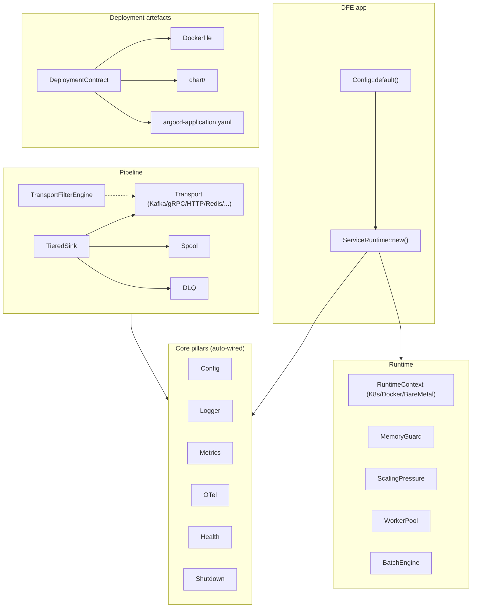

# hyperi-rustlib docs

Shared Rust library for HyperI services. Wire three lines at startup and you
get config cascade, structured logs, Prometheus metrics, health probes, OTel
traces, graceful shutdown, K8s pre-stop, and deployment-artefact generation
for free. Add a `Transport`, a `TieredSink`, a `BatchEngine` and the same
deal extends: counters, span propagation, DLQ routing, backpressure, scaling
signals — all automatic.

This is the index. Read [ARCHITECTURE.md](ARCHITECTURE.md) for the
10,000-foot view of how the modules fit together, [INTEGRATION.md](INTEGRATION.md)
for a recipe walkthrough on building a DFE service, [AUTO-WIRING.md](AUTO-WIRING.md)
for the "you-get-this-for-free" model, and [FEATURE-FLAGS.md](FEATURE-FLAGS.md)
for how features cascade into one another.

---

## What you get for free

| Wire this at startup | And these come along | No need to |
|----------------------|----------------------|------------|
| `config::setup(opts)` | 8-layer cascade, env-var nesting, `.env`, sensitive masking, hot-reload, `/config` admin endpoint, section registry | Wire figment, write a settings loader, build a reload watcher |
| `logger::setup_default()` | Structured tracing, JSON-in-container / human-on-TTY autodetect, RFC 3339 timestamps, sensitive-field masking, flooding helpers | Install a tracing subscriber, format JSON, pick a logger crate |
| `MetricsManager::new("app")` | Prometheus exporter, `/metrics` endpoint, process metrics, cardinality cap, `/metrics/manifest` catalogue | Stand up an exporter, wire a process collector, hand-roll a manifest |
| `ServiceRuntime::new(...)` | All of the above + memory guard + scaling pressure + worker pool + batch engine + shutdown token + K8s pre-stop delay + runtime context | Glue them together manually; six modules wire themselves |
| Any `Transport` impl | 3-tier filter engine, DLQ routing, per-direction/action metrics, W3C traceparent propagation | Add filters, wire DLQ, instrument send/recv |
| `TieredSink::new(...)` | Transport + disk-spillover spool + circuit breaker + retry + DLQ fallback + backpressure signal | Compose those primitives by hand |

That's the value proposition. Everything else in these docs is "and here's
how the pieces work".

---

## 10,000-foot view

Solid arrows are runtime data/control flow. Dashed arrows mark embedded
sub-components (filter engine lives inside every transport).

---

## Where to read what

### Start here

- [ARCHITECTURE.md](ARCHITECTURE.md) — module map, dependency graph, layering
- [INTEGRATION.md](INTEGRATION.md) — "I'm building a DFE app" walkthrough
- [AUTO-WIRING.md](AUTO-WIRING.md) — what's wired into what, and why
- [FEATURE-FLAGS.md](FEATURE-FLAGS.md) — feature tree, native deps, recommended bundles

### Core pillars (always-on, auto-wired)

- [core-pillars/CONFIG.md](core-pillars/CONFIG.md) — 8-layer cascade, hot-reload, registry, `/config` endpoint
- [core-pillars/LOGGING.md](core-pillars/LOGGING.md) — tracing setup, JSON/text autodetect, masking, flood control
- [core-pillars/METRICS.md](core-pillars/METRICS.md) — Prometheus, manifest, cardinality cap
- [core-pillars/TRACING.md](core-pillars/TRACING.md) — OTel, W3C traceparent, transport propagation
- [core-pillars/HEALTH.md](core-pillars/HEALTH.md) — `HealthRegistry`, `/healthz` / `/readyz` / `/startupz`
- [core-pillars/SHUTDOWN.md](core-pillars/SHUTDOWN.md) — `CancellationToken`, K8s pre-stop delay

### Runtime

- [runtime/SERVICE-RUNTIME.md](runtime/SERVICE-RUNTIME.md) — `ServiceRuntime`, `DfeApp` trait, `run_app`
- [runtime/RUNTIME-CONTEXT.md](runtime/RUNTIME-CONTEXT.md) — K8s/Docker/BareMetal detection, pod metadata
- [runtime/MEMORY.md](runtime/MEMORY.md) — `MemoryGuard`, cgroup-aware backpressure

### Transport

- [transport/OVERVIEW.md](transport/OVERVIEW.md) — trait architecture, factory, `AnySender`, commit tokens
- [transport/BACKENDS.md](transport/BACKENDS.md) — Kafka, gRPC, Memory, File, Pipe, HTTP, Redis
- [transport/FILTER-ENGINE.md](transport/FILTER-ENGINE.md) — 3-tier filter (SIMD / compiled CEL / complex CEL)
- [transport/ROUTING.md](transport/ROUTING.md) — `RoutedSender` for receiver and fetcher

### Deployment

- [deployment/CONTRACT.md](deployment/CONTRACT.md) — `DeploymentContract` struct, schema versioning
- [deployment/ARTEFACTS.md](deployment/ARTEFACTS.md) — generated Dockerfile, Helm chart, ArgoCD Application
- [deployment/NATIVE-DEPS.md](deployment/NATIVE-DEPS.md) — `NativeDepsContract`, feature → APT package map
- [deployment/KEDA.md](deployment/KEDA.md) — `KedaContract`, scaler triggers, fallback HPA

### Pipeline

- [pipeline/BATCH-ENGINE.md](pipeline/BATCH-ENGINE.md) — SIMD parse, pre-route filter, field interning
- [pipeline/WORKER-POOL.md](pipeline/WORKER-POOL.md) — `AdaptiveWorkerPool`, pressure-based scaling
- [pipeline/TIERED-SINK.md](pipeline/TIERED-SINK.md) — resilient delivery, disk spillover, circuit breaker
- [pipeline/DLQ.md](pipeline/DLQ.md) — file, Kafka, HTTP, Redis backends
- [pipeline/SPOOL.md](pipeline/SPOOL.md) — disk-backed async FIFO (yaque)
- [pipeline/STRMATCH.md](pipeline/STRMATCH.md) — 4-tier regex→fast-path matcher (Byte / Literal / LiteralSet / Regex)
- [pipeline/SCALING.md](pipeline/SCALING.md) — `ScalingPressure`, KEDA external scaler signal

### Less-common subsystems

- [api/SECRETS.md](api/SECRETS.md) — OpenBao/Vault, AWS Secrets Manager
- [api/HTTP-SERVER.md](api/HTTP-SERVER.md) — axum server, probe wiring, route extensions
- [api/HTTP-CLIENT.md](api/HTTP-CLIENT.md) — `reqwest` + retry + circuit breaker
- [api/CACHE.md](api/CACHE.md) — moka TinyLFU cache
- [api/DIRECTORY-CONFIG.md](api/DIRECTORY-CONFIG.md) — YAML directory store with optional `git2`
- [api/CONCURRENCY.md](api/CONCURRENCY.md) — `BackgroundSink`, `PeriodicWorker`, `ActorHandle`

### Planned (not in current release)

- **Content-based log scrubbing** (gitleaks rules + PII validators
  composed via `strmatch`). The current release ships field-name
  masking via `MaskingWriter` only — see
  [core-pillars/LOGGING.md](core-pillars/LOGGING.md) for what's
  shipped.

### Workflow artefacts (not user docs)

- [superpowers/](superpowers/) — design specs and execution plans for in-flight work
- [MIGRATIONS.md](MIGRATIONS.md) — API surface changes by rustlib version; consumer-rebuild playbook

---

## Project facts

- **Crate:** [hyperi-rustlib](https://crates.io/crates/hyperi-rustlib) (crates.io)
- **Edition:** 2024
- **MSRV:** 1.95
- **Used by:** [dfe-loader](https://github.com/hyperi-io/dfe-loader), [dfe-receiver](https://github.com/hyperi-io/dfe-receiver), [dfe-fetcher](https://github.com/hyperi-io/dfe-fetcher), [dfe-archiver](https://github.com/hyperi-io/dfe-archiver), [dfe-transform-vrl](https://github.com/hyperi-io/dfe-transform-vrl), [dfe-transform-vector](https://github.com/hyperi-io/dfe-transform-vector)
- **Sibling libs:** [hyperi-pylib](https://github.com/hyperi-io/hyperi-pylib) (Python equivalent)
