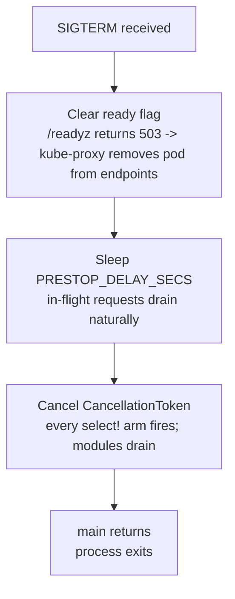

# Shutdown

`shutdown::install_signal_handler()` is called once at startup and returns a
`tokio_util::sync::CancellationToken` that every long-running task clones and
awaits via `token.cancelled().await`. On SIGTERM/SIGINT the handler sleeps for a
K8s pre-stop delay, then cancels the token. All tasks unblock together, drain
in-flight work, and exit; the process exits when `main` returns.

The pre-stop delay is the load-bearing detail. Without it the pod starts draining
before kube-proxy removes it from Service endpoints, so traffic keeps arriving at
a process no longer accepting work. With it, the pod stays in the endpoint list
during the delay window, the readiness probe (cleared at the start of the app's
shutdown wiring) takes it out of rotation, and only then does cancellation
propagate.

`ServiceRuntime` from `cli` calls `install_signal_handler` and hands the token to
`run_service`. DFE apps don't construct the token -- they receive it and `select!`
on `token.cancelled()` in every loop.

---

## Pre-stop delay

| Detection | Default | Override |
|---|---|---|
| K8s (via [`env::runtime_context().is_kubernetes()`](../../src/env.rs)) | 5 seconds | `PRESTOP_DELAY_SECS` |
| Docker / bare metal | 0 (immediate cancel) | `PRESTOP_DELAY_SECS` |

Tune `PRESTOP_DELAY_SECS` via a K8s `Deployment` env entry to match the cluster's
kube-proxy endpoint-sync latency. 5 seconds is the safe default.

The delay runs *before* token cancellation:



The ready-flag clearing (step B) is owned by `ServiceRuntime` / the app's shutdown
wiring, not `install_signal_handler` -- the shutdown module only does
signal + delay + cancel. See [../runtime/SERVICE-RUNTIME.md](../runtime/SERVICE-RUNTIME.md).

When SIGTERM arrives in K8s, the handler increments `pod_eviction_received_total`
(if `metrics` or `otel-metrics` is on) so eviction events are observable.

---

## Module pattern

Every long-running loop should `select!` on `token.cancelled()` as its first arm:

```rust
use hyperi_rustlib::shutdown;
use tokio_util::sync::CancellationToken;

async fn consumer_loop(token: CancellationToken, mut rx: kafka::Consumer) {
    loop {
        tokio::select! {
            biased;                              // shutdown wins ties
            () = token.cancelled() => {
                tracing::info!("draining consumer");
                rx.drain().await;
                break;
            }
            msg = rx.recv() => { if let Some(m) = msg { process(m).await; } }
        }
    }
}
```

`biased` checks shutdown first on every poll -- without it a saturated channel can
starve the cancellation branch. Enforced by code review and the audit script.

For scoped cancellation (cancel a sub-task without shutting down the service), use
`token.child_token()`. Cancelling the parent cancels every child; cancelling a
child leaves the parent running.

---

## Cancel-safety in `select!`

A future polled by `select!` and dropped when another arm wins must be safe to
drop at any await point. Most tokio primitives are; a few are not.

| Future | Cancel-safe? | Notes |
|---|---|---|
| `mpsc::Receiver::recv` | Yes | Drop abandons the wait |
| `oneshot::Receiver` | Yes | |
| `time::sleep` | Yes | |
| `TcpListener::accept` | Yes | |
| `CancellationToken::cancelled` | Yes | |
| `broadcast::Receiver::recv` | **No** | Dropping drops messages -- hoist OUT, `pin!` once, drop only on shutdown |
| `mpsc::Sender::send` after `reserve()` | **No** | Drop loses the permit slot |
| Any state machine you wrote yourself | Usually no | Default to "no" until proven otherwise |

The Kafka offset-commit path in `dfe-loader` was bitten by this: a
`broadcast::recv` inside `select!` dropped messages on every shutdown event,
corrupting committed offsets. The fix is the `pin!` hoist in
`standards/languages/RUST.md`.

---

## Triggering shutdown programmatically

For tests, integration drivers, or an internal watchdog:

```rust
hyperi_rustlib::shutdown::trigger();        // cancel global token; idempotent
hyperi_rustlib::shutdown::is_shutdown();    // check state without awaiting
```

---

## API surface

| Item | Purpose |
|---|---|
| `shutdown::install_signal_handler() -> CancellationToken` | Install SIGTERM/SIGINT handler; spawn the wait task; return the global token |
| `shutdown::token() -> CancellationToken` | Clone the global token (created lazily if no handler installed) |
| `shutdown::trigger()` | Cancel the global token |
| `shutdown::is_shutdown() -> bool` | Check cancellation state without awaiting |
| `CancellationToken::cancelled().await` | The await point every module loop uses |
| `CancellationToken::child_token()` | Scoped cancellation not affecting the parent |

| Var | Effect |
|---|---|
| `PRESTOP_DELAY_SECS` | Override pre-stop delay (default 5 in K8s, 0 elsewhere) |

---

## Testing

The global token is process-wide. Tests verifying shutdown behaviour construct a
fresh `CancellationToken::new()` and drive it locally rather than touching the
global -- see `trigger_cancels_token` and
`cancelled_future_resolves_after_cancel` in [`src/shutdown.rs`](../../src/shutdown.rs).

`install_signal_handler` spawns a tokio task; calling it twice is safe (the second
clones the same token; the second listener is inert) but call it once at the top
of `main`.

---

## Related

- [HEALTH.md](HEALTH.md) -- ready flag clearing precedes token cancel
- [METRICS.md](METRICS.md) -- `pod_eviction_received_total` on SIGTERM in K8s
- [../runtime/SERVICE-RUNTIME.md](../runtime/SERVICE-RUNTIME.md) -- `ServiceRuntime` calls `install_signal_handler`
- [../AUTO-WIRING.md](../AUTO-WIRING.md), [../FEATURE-FLAGS.md](../FEATURE-FLAGS.md)
- Source: [`src/shutdown.rs`](../../src/shutdown.rs)
