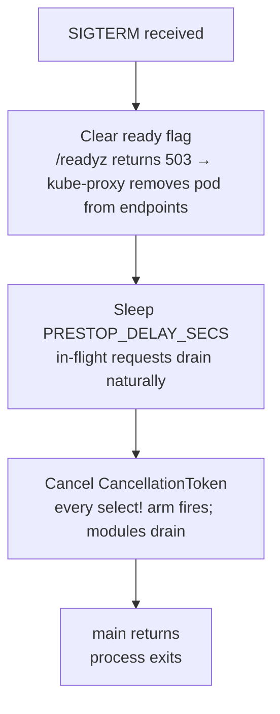

# Shutdown

`shutdown::install_signal_handler()` is called once at startup. It returns a
`tokio_util::sync::CancellationToken` that every long-running task clones and
listens on via `token.cancelled().await`. When SIGTERM or SIGINT arrives, the
handler sleeps for a K8s pre-stop delay, then cancels the token. All tasks
unblock simultaneously, drain in-flight work, and exit. The process exits
when `main` returns.

The pre-stop delay is the load-bearing detail that makes the system
K8s-compliant. Without it, the pod starts draining before kube-proxy removes
it from Service endpoints — so traffic continues arriving at a process that
is no longer accepting new work. With it, the pod stays in the Service
endpoint list during the delay window, the readiness probe (cleared at the
start of the handler) takes the pod out of rotation, and only then does the
cancellation propagate.

`ServiceRuntime` from `cli` calls `install_signal_handler` and exposes the
token to the app's `run_service` method. DFE apps don't construct the token
directly — they receive it and `select!` on `token.cancelled()` in every
loop.

---

## Pre-stop delay

| Detection | Default | Override |
|---|---|---|
| K8s detected via [`env::runtime_context().is_kubernetes()`](../../src/env.rs) | 5 seconds | `PRESTOP_DELAY_SECS` env var |
| Docker / bare metal | 0 seconds (immediate cancel) | `PRESTOP_DELAY_SECS` env var |

The env var override is the deployment-time knob. Tune it via a K8s
`Deployment` env entry to match the actual `kube-proxy` endpoint-sync
latency in the cluster. 5 seconds is the safe default for most clusters.

The delay runs *before* token cancellation. Sequence:



The ready-flag clearing in the actual flow is owned by `ServiceRuntime` /
the app's shutdown wiring, not `install_signal_handler` itself — the
shutdown module only handles the signal + delay + cancel sequence. See
[../runtime/SERVICE-RUNTIME.md](../runtime/SERVICE-RUNTIME.md).

When SIGTERM is received in K8s the `pod_eviction_received_total` counter
increments (if either `metrics` or `otel-metrics` is on) so eviction events
are observable in the metric stream.

---

## Module pattern

Every long-running module loop should `select!` on `token.cancelled()` as its
first arm:

```rust
use hyperi_rustlib::shutdown;
use tokio_util::sync::CancellationToken;

async fn consumer_loop(token: CancellationToken, mut rx: kafka::Consumer) {
    loop {
        tokio::select! {
            biased;                              // shutdown wins ties
            () = token.cancelled() => {
                tracing::info!("draining consumer");
                rx.drain().await;
                break;
            }
            msg = rx.recv() => {
                if let Some(m) = msg { process(m).await; }
            }
        }
    }
}
```

`biased` ensures shutdown is checked first on every poll — without it, a
saturated channel can starve the cancellation branch. The pattern is in the
audit script and is enforced by code review.

If a module needs its own scoped cancellation (e.g. cancel a sub-task
without shutting down the service), use `token.child_token()`. Cancelling
the parent cancels every child; cancelling a child leaves the parent
running.

---

## Cancel-safety in `select!`

A future polled by `select!` and dropped on a different arm winning must
be safe to drop at any await point. Most tokio primitives are; a few are not.

| Future | Cancel-safe? | Notes |
|---|---|---|
| `tokio::sync::mpsc::Receiver::recv` | Yes | Drop just abandons the wait |
| `tokio::sync::oneshot::Receiver` | Yes | |
| `tokio::time::sleep` | Yes | |
| `tokio::net::TcpListener::accept` | Yes | |
| `CancellationToken::cancelled` | Yes | |
| `tokio::sync::broadcast::Receiver::recv` | **No** | Dropping drops messages — hoist OUT of `select!`, `pin!` it once, only drop on shutdown |
| `tokio::sync::mpsc::Sender::send` after `reserve()` | **No** | Drop loses the permit slot |
| Any multi-step state machine you wrote yourself | Usually no | Default to "no" until proven otherwise |

The Kafka offset-commit path in `dfe-loader` was bitten by this: a
`broadcast::recv` inside `select!` dropped messages on every shutdown event,
which corrupted committed offsets. The fix is the `pin!` hoist pattern in
`standards/languages/RUST.md`.

---

## Triggering shutdown programmatically

For tests, integration drivers, or a watchdog that needs to terminate the
service from inside:

```rust
hyperi_rustlib::shutdown::trigger();
```

Cancels the global token. Idempotent — multiple calls are no-ops. Use
`shutdown::is_shutdown()` to check state without awaiting.

---

## API surface

| Item | Purpose |
|---|---|
| `shutdown::install_signal_handler() -> CancellationToken` | Install SIGTERM/SIGINT handler; spawns the wait task; returns the global token |
| `shutdown::token() -> CancellationToken` | Get a clone of the global token (creates it lazily if no handler is installed) |
| `shutdown::trigger()` | Cancel the global token programmatically |
| `shutdown::is_shutdown() -> bool` | Check cancellation state without awaiting |
| `tokio_util::sync::CancellationToken::cancelled().await` | The await point every module loop uses |
| `CancellationToken::child_token()` | Scoped cancellation that does not affect the parent |

Environment:

| Var | Effect |
|---|---|
| `PRESTOP_DELAY_SECS` | Override pre-stop delay (default 5 in K8s, 0 elsewhere) |

---

## Testing

The global token is process-wide. Tests that need to verify shutdown
behaviour should construct a fresh `CancellationToken::new()` and drive it
locally, rather than touching the global. The pattern is in
[`src/shutdown.rs`](../../src/shutdown.rs) — `trigger_cancels_token` and
`cancelled_future_resolves_after_cancel` both work with local tokens for
exactly this reason.

`install_signal_handler` spawns a tokio task; calling it twice in the same
process is safe (the second call clones the same token, and the second
signal listener is wasteful but inert) but it's still better to call it
once at the top of `main`.

---

## Related

- [HEALTH.md](HEALTH.md) — ready flag clearing precedes token cancel
- [METRICS.md](METRICS.md) — `pod_eviction_received_total` on SIGTERM in K8s
- [../runtime/SERVICE-RUNTIME.md](../runtime/SERVICE-RUNTIME.md) — `ServiceRuntime` calls `install_signal_handler` for the app
- [../AUTO-WIRING.md](../AUTO-WIRING.md), [../FEATURE-FLAGS.md](../FEATURE-FLAGS.md)
- Source: [`src/shutdown.rs`](../../src/shutdown.rs)
