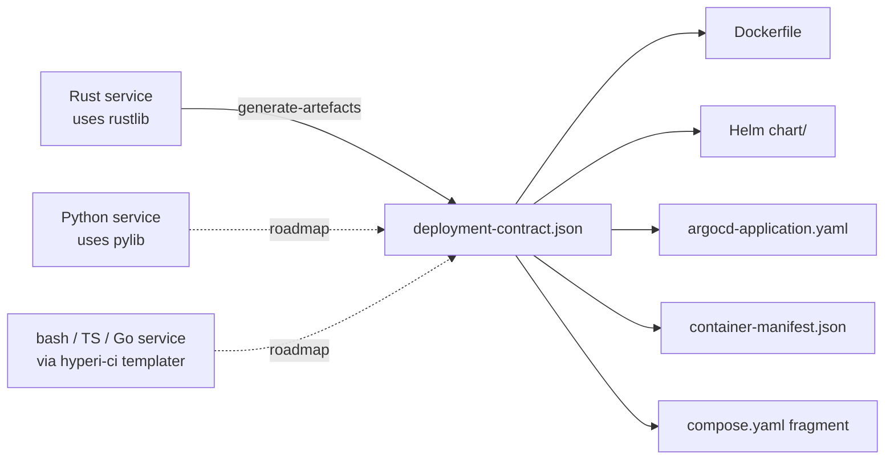

# Contract

`DeploymentContract` is the single struct every HyperI service fills
in once. From it, rustlib derives every deployment artefact the
service needs — Dockerfile, Helm chart, Compose fragment, ArgoCD
`Application`, container manifest, runtime-stage fragment — without
the app touching a YAML template.

The pitch: **fill in the 20% that's app-specific, get the 80% that's
boilerplate for free**. Drift between the contract and the generated
artefacts is caught by `validate_*` in CI.

---

## Why a contract

Hand-maintained Dockerfiles and Helm charts rot. Ports get added to
the binary but never the chart; healthcheck paths change; new secrets
land in code but the K8s `Secret` template still references the old
key names. The contract makes the binary the source of truth — the
app declares its surface, generation produces matching artefacts,
validation guards the boundary.

---

## Schema versioning

`DeploymentContract::schema_version` is checked by CI. The current
version is **2**. Bumps happen when the struct shape changes in a
way that breaks downstream consumers — the version field gives CI a
fail-fast hook before generation runs against a stale contract.

| Version | Notes |
|---------|-------|
| 1 | Initial shape — no `image_profile`, no `oci_labels` |
| 2 | Current — `ImageProfile`, `OciLabels`, restructured secrets (`SecretGroupContract`) |

---

## Producer tiers



| Tier | Producer | Status |
|------|----------|--------|
| 1 | rustlib (this crate) — Rust services emit the contract from their config struct | **Shipped** |
| 2 | pylib — Python services emit the same contract shape | **Roadmap** |
| 3 | hyperi-ci templater — bash/TS/Go services emit the contract via templating | **Roadmap** |

Tier 2/3 are aspirational — the contract is JSON-serialisable and
language-neutral by design, but only the Rust producer exists today.
Cross-language consumers should read `deployment-contract.json` (the
serialised form), not import this crate.

---

## Struct shape

```rust
use hyperi_rustlib::deployment::*;

let contract = DeploymentContract {
    schema_version: 2,
    app_name: "dfe-loader".into(),
    binary_name: "dfe-loader".into(),
    description: "Kafka -> ClickHouse data loader".into(),
    metrics_port: 9090,
    health: HealthContract::default(),     // /healthz, /readyz, /metrics
    env_prefix: "DFE_LOADER".into(),
    metric_prefix: "loader".into(),
    config_mount_path: "/etc/dfe/loader.yaml".into(),
    image_registry: image_registry_from_cascade(),   // "ghcr.io/hyperi-io"
    base_image: base_image_from_cascade(),           // "ubuntu:24.04"
    extra_ports: vec![],
    entrypoint_args: vec!["--config".into(), "/etc/dfe/loader.yaml".into()],
    secrets: vec![
        SecretGroupContract {
            group_name: "kafka".into(),
            env_vars: vec![
                SecretEnvContract {
                    env_var: "DFE_LOADER__KAFKA__USERNAME".into(),
                    key_name: "username".into(),
                    secret_key: "kafka-username".into(),
                },
                SecretEnvContract {
                    env_var: "DFE_LOADER__KAFKA__PASSWORD".into(),
                    key_name: "password".into(),
                    secret_key: "kafka-password".into(),
                },
            ],
        },
    ],
    default_config: None,
    depends_on: vec!["kafka".into(), "clickhouse".into()],
    keda: Some(KedaContract::default()),
    native_deps: NativeDepsContract::for_rustlib_features(
        &["transport-kafka", "spool", "tiered-sink"],
        "ubuntu:24.04",
    ),
    image_profile: ImageProfile::Production,
    oci_labels: OciLabels::default(),
};
```

The shape that bites people most often is `secrets` — it's `Vec<SecretGroupContract>`,
not flat. Each group bundles env vars sharing the same K8s `Secret`
(e.g. one Secret per backend: Kafka credentials, ClickHouse password,
Vault token).

| Field | Purpose |
|-------|---------|
| `group_name` | Section name in `values.yaml`, helper template suffix (`kafkaSecretName`) |
| `env_vars[].env_var` | The full env var name injected into the pod (`DFE_LOADER__KAFKA__PASSWORD`) |
| `env_vars[].key_name` | Field name in `values.yaml.<group>.secretKeys.<key_name>` |
| `env_vars[].secret_key` | Default K8s Secret data key (`kafka-password`) |

---

## Dev profile derivation

`ImageProfile::Development` is a one-line variant — same binary,
same linking, plus diagnostic tools (`bash`, `strace`, `tcpdump`,
`procps`, `dnsutils`, `net-tools`, `less`, `jq`) and a `-dev` image
tag suffix.

```rust
let prod = build_contract();
let dev  = prod.with_dev_profile();   // ImageProfile::Development

generate_dockerfile(&prod);    // ubuntu:24.04 + runtime libs only
generate_dockerfile(&dev);     // + strace, tcpdump, ...
```

CI typically produces both: `:1.15.0` (prod) and `:1.15.0-dev` (dev).
Operators pull the dev image into a debug pod for forensic work
without rebuilding.

---

## Cascade-driven defaults

Three fields read from the config cascade so ops can change them
org-wide without rebuilding each app:

| Function | Cascade key | Default |
|----------|-------------|---------|
| `image_registry_from_cascade()` | `deployment.image_registry` | `ghcr.io/hyperi-io` |
| `base_image_from_cascade()` | `deployment.base_image` | `ubuntu:24.04` |
| `argocd_repo_url_from_cascade(app)` | `deployment.argocd.repo_url` | `https://github.com/hyperi-io/<app>` |

Apps wire these into their contract builder so the registry and base
image are pulled from `settings.yaml` rather than baked into source.

---

## API surface

| Item | Purpose |
|------|---------|
| `DeploymentContract` | Top-level contract struct |
| `DeploymentContract::with_dev_profile()` | Clone with `ImageProfile::Development` |
| `DeploymentContract::to_json()` / `to_yaml()` | Serialise for CI consumption |
| `DeploymentContract::binary()` | Effective binary name (falls back to `app_name`) |
| `DeploymentContract::config_filename()` / `config_dir()` | Split `config_mount_path` |
| `ImageProfile::{Production, Development}` | Profile enum |
| `HealthContract` | `/healthz` / `/readyz` / `/metrics` paths |
| `PortContract` | Extra container port beyond `metrics_port` |
| `SecretGroupContract` | One K8s Secret's worth of env vars |
| `SecretEnvContract` | Single env var sourced from a Secret key |
| `OciLabels` | Static OCI labels (`title`, `description`, `vendor`, `licenses`) |
| `NativeDepsContract` | Runtime APT packages — see [NATIVE-DEPS.md](NATIVE-DEPS.md) |
| `KedaContract` | Autoscaling thresholds — see [KEDA.md](KEDA.md) |
| `ArgocdConfig` | ArgoCD `Application` repo / path / namespace |
| `DEFAULT_IMAGE_REGISTRY` / `DEFAULT_BASE_IMAGE` | Defaults used when cascade is silent |
| `image_registry_from_cascade()` / `base_image_from_cascade()` / `argocd_repo_url_from_cascade()` | Cascade readers |

---

## CI integration

The contract is emitted by `<app> generate-artefacts --output-dir ci/`,
a standard subcommand from the `cli` feature. CI then runs `validate_*`
to confirm the chart/Dockerfile in the repo still match what the
contract describes.

See [ARTEFACTS.md](ARTEFACTS.md) for what generation writes and
[../INTEGRATION.md](../INTEGRATION.md) for the `DfeApp::deployment_contract`
hook that exposes the contract to the CLI.

---

## Related

- [ARTEFACTS.md](ARTEFACTS.md) — what `generate-artefacts` writes
- [NATIVE-DEPS.md](NATIVE-DEPS.md) — auto-detected APT packages
- [KEDA.md](KEDA.md) — autoscaling contract
- [../AUTO-WIRING.md](../AUTO-WIRING.md) — singleton pattern
- [../INTEGRATION.md](../INTEGRATION.md) — `DfeApp` trait
- [../FEATURE-FLAGS.md](../FEATURE-FLAGS.md) — `deployment`, `cli`
- Source: [../../src/deployment/contract.rs](../../src/deployment/contract.rs)
