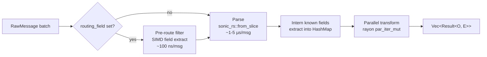

# Batch Engine

SIMD-optimised batch processor for DFE mid-tier pipelines. Parses JSON
via `sonic-rs`, applies pre-route filters before parsing where it can,
interns known field names via `dashmap`, and runs the user transform
across a rayon pool. Auto-wired by `ServiceRuntime` when the
`worker-batch` feature is on.

`BatchEngine` is the standard ingest-loop primitive for loader,
archiver, and transform apps — it sits between a `TransportReceiver`
and an app-supplied sink.

---

## Two modes

| API | Parses? | Transform receives | Use case |
|-----|---------|--------------------|----------|
| `process_mid_tier` | Yes (SIMD JSON) | `&mut ParsedMessage` | Loader, archiver, VRL — needs field access |
| `process_raw` | No | `&RawMessage` | Receiver forwarding, binary protocols, opaque payloads |

Both chunk the input at `max_chunk_size` (default 10 000), call the
transform across a rayon pool, and pause between chunks when memory
pressure is high.

---

## Pipeline phases (mid-tier)



Filter-rejected messages are removed from the output. DLQ-routed and
parse-error messages become `Err` entries; the action is configured
via `parse_error_action: dlq | skip | fail_batch`.

`process_raw` skips the parse and intern phases — pre-route runs on
raw bytes only.

---

## Field interning

`FieldInterner` deduplicates field-name strings via
`DashMap<Arc<str>, ()>`. Pre-populated at construction with the
configured `known_fields` (`_table`, `_timestamp`, `_source`, `host`,
`source_type`, `event_type` by default). Hot-path costs:

| Path | Cost |
|------|------|
| Already interned (`Arc::clone`) | ~20 ns |
| First occurrence (`Arc::from` + insert) | ~100 ns |

Once a field is interned, every subsequent batch reuses the same
`Arc<str>` — the slow path runs at most once per unique field per
process. `ParsedMessage::field()` checks the extracted map first
(interned fast path) before walking the full JSON tree.

See [`../../src/worker/engine/intern.rs`](../../src/worker/engine/intern.rs).

---

## Async transport-wired variants

Four async methods drive the engine from a `TransportReceiver`:

| Method | Sink | Commit | Ticker |
|--------|------|--------|--------|
| `run` | Sync `FnMut(results) -> Result<(), EngineError>` | Auto-committed by engine on sink success | None |
| `run_raw` | Same | Same | None |
| `run_async` | Async `FnMut(results, tokens) -> impl Future` | Sink-managed | Optional `(Duration, FnMut() -> impl Future)` |
| `run_raw_async` | Same | Sink-managed | Optional |

The async variants give the sink full control over commit semantics —
the sink receives both the results and the transport commit tokens, so
it can defer commit until after a downstream write (e.g. ClickHouse
flush, S3 PUT) rather than after the in-memory buffer push.

The optional ticker fires inside the `tokio::select!` loop so flush
timers and periodic maintenance run without breaking out of the engine
loop. The select arms are `biased` — shutdown is checked first.

---

## Auto-wiring

`ServiceRuntime` builds the engine when the `worker-batch` feature is
on, reusing the runtime's `AdaptiveWorkerPool` so no second rayon pool
is created:

```rust
let engine = BatchEngine::with_pool(runtime.worker_pool.clone(), cfg);
```

`auto_wire(&MetricsManager, Option<&MemoryGuard>)` registers metrics
and attaches the memory guard. Apps that want a standalone engine
outside the runtime use `BatchEngine::new` or
`BatchEngine::from_cascade("batch_processing")`.

---

## Configuration

Loaded from the `batch_processing` cascade key:

```yaml
batch_processing:
  max_chunk_size: 10000          # 0 = whole batch in one chunk
  format: auto                    # auto | json | msgpack
  routing_field: _table           # null disables pre-route
  pre_route_filters:
    - type: drop_field_missing
      field: _table
    - type: dlq_field_value
      field: _table
      value: poison
  parse_error_action: dlq         # dlq | skip | fail_batch
  memory_pressure_pause_ms: 50
  known_fields:
    - _table
    - _timestamp
    - _source
    - host
    - source_type
    - event_type
```

`max_chunk_size = 0` processes the whole batch in a single rayon job.
`memory_pressure_pause_ms` only fires between chunks, never per
message.

---

## API surface

| Item | Purpose |
|------|---------|
| `BatchEngine::new(cfg)` | Standalone engine — builds its own worker pool |
| `BatchEngine::with_pool(pool, cfg)` | Reuse an existing pool (preferred when `ServiceRuntime` is available) |
| `BatchEngine::from_cascade(key)` | Load config from the cascade |
| `process_mid_tier(messages, transform)` | Sync — parse JSON, extract known fields, run transform on `&mut ParsedMessage` via rayon |
| `process_raw(messages, transform)` | Sync — no parse; run transform on `&RawMessage` via rayon |
| `run(receiver, shutdown, transform, sink)` | Async loop, sync sink, engine commits tokens |
| `run_raw(receiver, shutdown, transform, sink)` | Same, raw mode |
| `run_async(receiver, shutdown, transform, sink, ticker)` | Async loop, async sink, sink-managed commits, optional ticker |
| `run_raw_async(receiver, shutdown, transform, sink, ticker)` | Same, raw mode |
| `auto_wire(metrics, memory_guard)` | Called by `ServiceRuntime` — apps never call directly |
| `stats() -> &Arc<PipelineStats>` | Atomic counters (received, processed, errors, filtered, dlq, bytes) |
| `pool() -> &Arc<AdaptiveWorkerPool>` | Underlying rayon pool |
| `config() -> &BatchProcessingConfig` | Active config |

The transform closure is `Fn(...) -> Result<O, E>` with
`E: Send + From<String>` — DLQ and parse-error reasons are surfaced as
`E::from(reason)` so the app's error type controls how they flow
downstream.

---

## Source

- [`../../src/worker/engine/mod.rs`](../../src/worker/engine/mod.rs)
- [`../../src/worker/engine/intern.rs`](../../src/worker/engine/intern.rs)
- [`../../src/worker/engine/parse.rs`](../../src/worker/engine/parse.rs)
- [`../../src/worker/engine/pre_route.rs`](../../src/worker/engine/pre_route.rs)
- [`../../src/worker/engine/config.rs`](../../src/worker/engine/config.rs)

---

## Related

- [WORKER-POOL.md](WORKER-POOL.md) — the rayon-backed pool that runs the transform phase
- [TIERED-SINK.md](TIERED-SINK.md) — common sink target for the async variants
- [../runtime/SERVICE-RUNTIME.md](../runtime/SERVICE-RUNTIME.md) — auto-wiring entry point
- [../runtime/MEMORY.md](../runtime/MEMORY.md) — memory guard wired in via `auto_wire`
- [../transport/OVERVIEW.md](../transport/OVERVIEW.md) — `TransportReceiver` consumed by the async run loops
- [../transport/FILTER-ENGINE.md](../transport/FILTER-ENGINE.md) — wire-level filter (runs at the transport, not inside the engine)
- [../FEATURE-FLAGS.md](../FEATURE-FLAGS.md) — `worker-batch` (pulls `worker-pool`)
- [../AUTO-WIRING.md](../AUTO-WIRING.md)
- [../ARCHITECTURE.md](../ARCHITECTURE.md)
