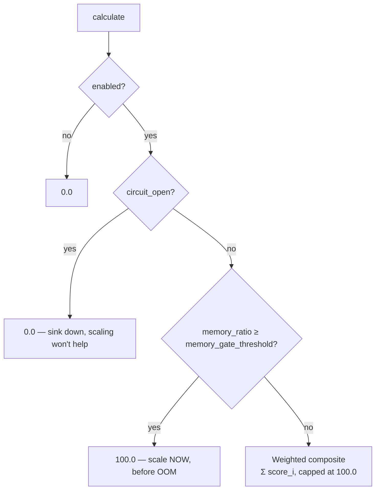

# Scaling

`ScalingPressure` produces a single `f64` in the range `0.0..=100.0`
that KEDA consumes via its Prometheus external scaler. The value is a
weighted composite over N app-specific `ScalingComponent`s, with two
hard gates that override the composite when the right thing to do is
unambiguous.

Lock-free updates from any thread (component values stored as
`f64::to_bits()` in `AtomicU64`, all writes `Relaxed`). Pressure is a
hint, not a synchronisation primitive — KEDA polls it on its own
cadence.

---

## Hard gates first, composite second



| Gate | Trigger | Output | Why |
|------|---------|--------|-----|
| **Circuit breaker** | `set_circuit_open(true)` | `0.0` | Downstream sink is unavailable. Adding replicas can't help — they'd also fail. Don't scale. |
| **Memory pressure** | `memory_used / memory_limit ≥ memory_gate_threshold` (default 0.8) | `100.0` | OOM is imminent. Bypass the composite and call for max scale immediately. |

Without hard gates, a weighted composite smears over both cases —
during a sink outage it would still call for scaling (wasteful and
potentially harmful); during a memory event it would scale gradually
based on whatever other signals are weighted high. The gates make the
right thing happen unambiguously.

Order: enabled → circuit → memory → composite. Circuit takes
precedence over memory by design.

---

## Composite scoring

```text
score_i = min(value_i / saturation_i, 1.0) * weight_i * 100.0
pressure = min(Σ score_i, 100.0)
```

Each component contributes `weight_i * 100` when it reaches its
saturation point, scales linearly below that, and is capped at its
weight (no over-contribution). Weights should sum to ~1.0 — the cap
on the total keeps the output well-formed even if they don't.

Example composition for dfe-loader:

| Component | Weight | Saturation | Source |
|-----------|--------|------------|--------|
| `kafka_lag` | 0.35 | 100 000 | Consumer lag from the Kafka client |
| `buffer_depth` | 0.25 | 10 000 | In-memory batch buffer depth |
| `insert_latency` | 0.15 | 5.0 s | ClickHouse insert latency p99 |
| `memory` | 0.15 | 1.0 | Memory pressure ratio (also a gate) |
| `errors` | 0.10 | 100 | Recent error count |

---

## Why CPU is not in the composite

CPU is intentionally **not** weighted into the pressure value. KEDA
has a native CPU trigger that reads container-level CPU from the
Kubernetes metrics-server. The right wiring is two independent KEDA
triggers in the `ScaledObject`:

- **`scaling_pressure` gauge** → Prometheus scaler → app-level signals
- **CPU utilisation** → CPU scaler → container-level, via metrics-server

KEDA scales to the MAX of all triggers. Mixing CPU into the composite
would double-count and obscure which signal is driving the scale.

---

## How KEDA reads it

The `/scaling/pressure` endpoint is mounted on the metrics HTTP
server when `MetricsManager::set_scaling_pressure` has been called
(which `ServiceRuntime` does automatically). Body is a plain text
float — `format!("{:.2}", pressure.calculate())`.

KEDA's Prometheus scaler queries the same value via the
`dfe_scaling_pressure` gauge published into the Prometheus registry.
Two surfaces, one number — pick whichever your KEDA setup expects.

```yaml
# KEDA ScaledObject excerpt
triggers:
  - type: prometheus
    metadata:
      serverAddress: http://prometheus:9090
      query: dfe_scaling_pressure{app="dfe-loader"}
      threshold: "50"
  - type: cpu
    metadata:
      type: Utilization
      value: "80"
```

See [`../../src/metrics/mod.rs`](../../src/metrics/mod.rs) for the
endpoint mount.

---

## App-side wiring

Apps register their components by overriding
`DfeApp::scaling_components`:

```rust
impl DfeApp for LoaderApp {
    fn scaling_components(&self, _cfg: &Self::Config) -> Vec<ScalingComponent> {
        vec![
            ScalingComponent::new("kafka_lag",      0.35, 100_000.0),
            ScalingComponent::new("buffer_depth",   0.25, 10_000.0),
            ScalingComponent::new("insert_latency", 0.15, 5.0),
            ScalingComponent::new("memory",         0.15, 1.0),
            ScalingComponent::new("errors",         0.10, 100.0),
        ]
    }
}
```

`ServiceRuntime` constructs the `ScalingPressure`, registers the
`/scaling/pressure` endpoint via `MetricsManager`, and wires
`worker_pool.set_scaling_pressure` so pool saturation also feeds into
the signal. Apps then update component values from their pipeline:

```rust
runtime.scaling.as_ref().unwrap().set_component("kafka_lag", lag as f64);
runtime.scaling.as_ref().unwrap().set_memory(used, limit);
```

The `dfe.scaling_pressure(value)` / `dfe.scaling_circuit_open(...)` /
`dfe.scaling_memory_pressure(...)` helpers on `DfeMetrics` write the
companion gauges (`dfe_scaling_pressure`,
`dfe_scaling_circuit_open`, `dfe_scaling_memory_pressure`) for
dashboard overlay.

---

## Configuration

```yaml
scaling:
  enabled: true
  memory_gate_threshold: 0.80
```

Base config only — per-component weights and saturations live in the
app's config struct (since they're app-specific). The default
threshold of 0.80 fires the memory gate when used/limit crosses 80%.

`ScalingPressureConfig::from_cascade()` reads the `scaling` key and
falls back to defaults if absent.

---

## API surface

| Item | Purpose |
|------|---------|
| `ScalingPressure::new(config, components)` | Build calculator with the given components and config |
| `set_component(name, value)` | Update a component (lock-free, unknown names are no-ops) |
| `set_circuit_open(bool)` | Toggle the circuit-breaker gate |
| `set_memory(used_bytes, limit_bytes)` | Update the memory gate inputs |
| `calculate() -> f64` | Apply gates + composite, return `0.0..=100.0` |
| `snapshot() -> PressureSnapshot` | Diagnostic — `{value, gate_active, components, memory_ratio, circuit_open}` |
| `is_enabled() -> bool` | Reflects `config.enabled` |
| `ScalingComponent::new(name, weight, saturation)` | Component constructor |
| `ScalingPressureConfig::from_cascade()` | Load base config from `scaling` cascade key |
| `GateType::CircuitBreaker / MemoryPressure` | Diagnostic — which gate (if any) is currently active |
| `RateWindow` | Helper for converting per-event rates into windowed pressure inputs |
| `DfeApp::scaling_components(&self, &config) -> Vec<ScalingComponent>` | App registration hook (default empty) |

---

## Source

- [`../../src/scaling/mod.rs`](../../src/scaling/mod.rs)
- [`../../src/scaling/pressure.rs`](../../src/scaling/pressure.rs) — calculator, gates, atomic component storage
- [`../../src/scaling/config.rs`](../../src/scaling/config.rs)
- [`../../src/scaling/rate_window.rs`](../../src/scaling/rate_window.rs)

---

## Related

- [WORKER-POOL.md](WORKER-POOL.md) — pool saturation feeds into the composite as `worker_pool_saturation`
- [TIERED-SINK.md](TIERED-SINK.md) — the circuit-breaker source that drives the gate
- [../runtime/MEMORY.md](../runtime/MEMORY.md) — the memory pressure source
- [../runtime/SERVICE-RUNTIME.md](../runtime/SERVICE-RUNTIME.md) — auto-wiring entry point
- [../FEATURE-FLAGS.md](../FEATURE-FLAGS.md) — `scaling`
- [../AUTO-WIRING.md](../AUTO-WIRING.md)
- [../ARCHITECTURE.md](../ARCHITECTURE.md)
