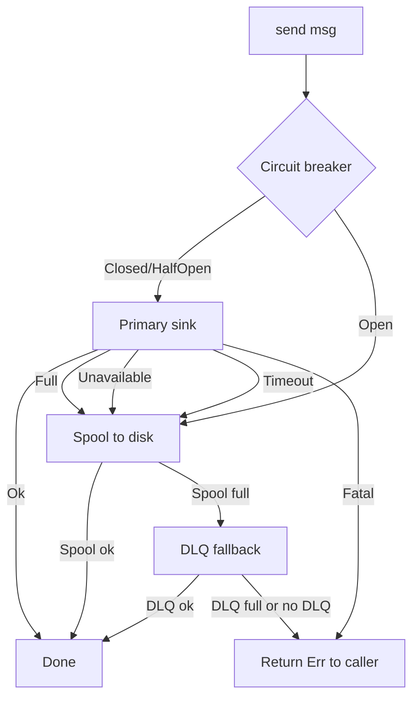

# Tiered Sink

`TieredSink<S>` wraps any `Sink` backend (Kafka, gRPC, S3, HTTP) with
the resilience primitives every production DFE pipeline needs —
timeout, circuit breaker, disk spillover, background drain. Apps call
`sink.send(msg).await?` and the sink picks the right failure response.

This is the canonical "resilient delivery" primitive. Every downstream
write in the DFE stack should sit behind one.

---

## What it composes

```text
          ┌────────────────────────────────────────┐
          │           TieredSink<S>                │
send() ──►│                                        │
          │  ┌──── hot path ────────────────┐      │
          │  │ circuit.state == Closed?     │      │
          │  │ try_send with timeout        │──Ok─►│──► caller
          │  └──── retry / backoff ─────────┘      │
          │             │                          │
          │       Full / Unavailable / timeout     │
          │             │                          │
          │  ┌──── cold path ───────────────┐      │
          │  │ compress (LZ4/Snappy/Zstd)   │      │
          │  │ append to yaque spool        │──Ok─►│──► caller
          │  └──────────────────────────────┘      │
          │             │                          │
          │       SpoolFull / DiskUnavailable      │
          │             │                          │
          │  ┌──── fatal ───────────────────┐      │
          │  │ Sink::Fatal — propagate err  │──────│──► caller (Err)
          │  └──────────────────────────────┘      │
          │                                        │
          │  Background drain task (always running)│
          │  When circuit recovers → spool → sink  │
          └────────────────────────────────────────┘
```

A `disk_capacity_poller` watches the spool filesystem when
`disk_aware` is configured — if usage crosses the threshold the
`disk_available` flag flips and new spool writes return
`DiskUnavailable` instead of silently filling the disk.

---

## Failure modes



| Sink result | Disposition | Circuit effect |
|-------------|-------------|----------------|
| `Ok(())` | Done | Records success — closes circuit if Open/HalfOpen |
| `Err(Full)` | Spool to disk | No failure counted (backpressure ≠ unhealthy) |
| `Err(Unavailable)` | Spool to disk | Failure counted, may open circuit |
| `Err(Fatal(e))` | Return `Err` to caller | No spool, no circuit change |
| Timeout | Spool to disk | Failure counted, may open circuit |

Backends classify errors via the three-way `SinkError<E>` enum (`Full`
| `Unavailable` | `Fatal`). The `is_retryable` / `is_fatal` /
`should_circuit_break` helpers on `SinkError` document the semantics.

---

## Circuit breaker

Three states, evaluated per `send`:

```
CLOSED ── consecutive_failures ≥ threshold ──► OPEN
   ▲                                              │
   │ record_success                               │ reset_timeout elapsed
   │                                              ▼
   └──── record_success ────────────────────── HALF_OPEN
              ▲                                   │
              └─── record_failure ────────────────┘
```

- **Closed** — hot path active, failures counted.
- **Open** — hot path skipped, every message goes straight to spool.
- **Half-open** — one probe allowed; success → Closed, failure → Open.

Hooks into the global `HealthRegistry` (when `health` feature is on)
so `/readyz` reports the sink as Degraded (HalfOpen) or Unhealthy
(Open).

See [`../../src/tiered_sink/circuit.rs`](../../src/tiered_sink/circuit.rs).

---

## Ordering modes

| Mode | Hot path policy | Trade-off |
|------|-----------------|-----------|
| `Interleaved` (default) | Always try hot path when circuit allows | Max throughput; new messages may arrive before older spooled ones |
| `StrictFifo` | Hot path only when spool is empty | Strict order; new traffic queues behind drain |

`StrictFifo` is what you pick when downstream ordering matters
(transaction log replication, append-only stores). Most pipelines
accept the interleave for the throughput win.

---

## Drain strategies

The background drain (`drainer::drain_loop`) pulls from the spool and
re-tries the primary sink at a rate controlled by `DrainStrategy`:

| Strategy | Behaviour |
|----------|-----------|
| `Adaptive { initial_rate, max_rate }` (default) | Start slow (100 msg/s), accelerate based on success rate, cap at `max_rate` (10 000 msg/s) |
| `RateLimited { msgs_per_sec }` | Fixed rate |
| `Greedy` | Drain as fast as possible — risks overwhelming a recovering sink |

The drain task is `tokio::spawn`'d at construction and stops on
`shutdown.notify_one()`.

---

## Spool sizing and disk awareness

- `max_spool_items` — reject new spool writes once the count is hit.
- `max_spool_bytes` — same, in bytes (post-compression).
- `disk_aware: { max_usage_percent, poll_interval_secs }` — background
  `statvfs` poller; once filesystem use crosses the threshold,
  `disk_available` flips false and spool writes return
  `DiskUnavailable`.

Hitting any limit causes `send` to return
`TieredSinkError::SpoolFull` or `DiskUnavailable`. The caller decides
what to do — typical pattern is to route to the DLQ.

---

## Configuration

```yaml
tiered_sink:
  spool_path: /var/spool/dfe-loader/clickhouse
  send_timeout_ms: 1000
  compression: { type: zstd, level: 1 }
  drain_strategy:
    type: adaptive
    initial_rate: 100
    max_rate: 10000
  ordering: interleaved
  max_spool_items: 1000000
  max_spool_bytes: 10737418240   # 10 GiB
  circuit_failure_threshold: 5
  circuit_reset_timeout_ms: 30000
  drain_interval_ms: 100
  disk_aware:
    max_usage_percent: 0.8
    poll_interval_secs: 5
```

`TieredSinkConfig::new(path)` plus the builder methods cover the
common cases without writing the full struct.

---

## API surface

| Item | Purpose |
|------|---------|
| `TieredSink::new(sink, config)` | Construct, open spool, spawn drain task |
| `send(data) -> Result<()>` | Send with hot-path → spool → DLQ-by-caller fallback |
| `spool_len() / spool_is_empty() / spool_bytes()` | Spool depth introspection |
| `circuit_state()` | Current `CircuitState` |
| `reset_circuit()` | Manual reset (admin / test) |
| `hot_path_count() / cold_path_count()` | Cumulative path counters |
| `is_disk_available()` | Disk-aware poller flag |
| `inner() -> &S` | Borrow the wrapped backend |
| `shutdown()` | Stop the drain task and drainer-side join |
| `Sink` trait | `type Error: StdError + Send + Sync; async fn try_send(&self, data: &[u8]) -> Result<(), SinkError<Self::Error>>` |
| `SinkError<E>` | `Full / Unavailable / Fatal(E)` — drives spillover behaviour |
| `CircuitBreaker` / `CircuitState` | Exposed for tests and custom integrations |

Drop fires `shutdown.notify_one()` — the drain exits cleanly even if
the consumer forgets to call `shutdown().await`.

---

## Source

- [`../../src/tiered_sink/mod.rs`](../../src/tiered_sink/mod.rs)
- [`../../src/tiered_sink/tiered.rs`](../../src/tiered_sink/tiered.rs)
- [`../../src/tiered_sink/sink.rs`](../../src/tiered_sink/sink.rs)
- [`../../src/tiered_sink/circuit.rs`](../../src/tiered_sink/circuit.rs)
- [`../../src/tiered_sink/drainer.rs`](../../src/tiered_sink/drainer.rs)
- [`../../src/tiered_sink/codec.rs`](../../src/tiered_sink/codec.rs) — compression
- [`../../src/tiered_sink/config.rs`](../../src/tiered_sink/config.rs)

---

## Related

- [SPOOL.md](SPOOL.md) — the yaque-backed disk queue under the hood
- [DLQ.md](DLQ.md) — where to send `SpoolFull` / `Fatal` errors
- [BATCH-ENGINE.md](BATCH-ENGINE.md) — common sink target for `run_async`
- [../transport/OVERVIEW.md](../transport/OVERVIEW.md)
- [../FEATURE-FLAGS.md](../FEATURE-FLAGS.md) — `tiered-sink`
- [../AUTO-WIRING.md](../AUTO-WIRING.md)
- [../ARCHITECTURE.md](../ARCHITECTURE.md)
