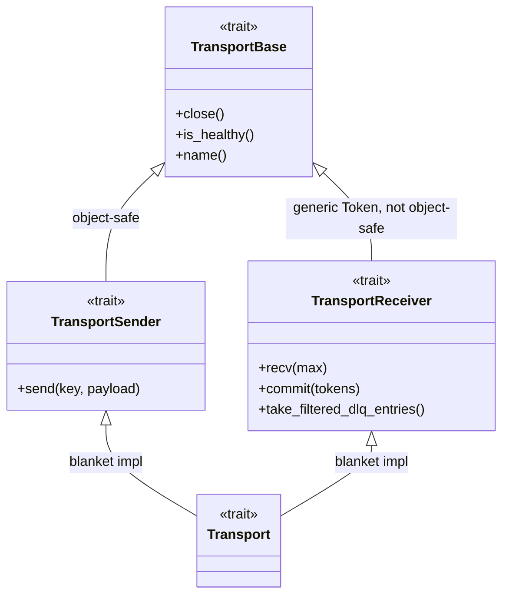

# Overview

The transport layer is the boundary between an app and any
message-shaped backend — Kafka, gRPC, Memory, File, Pipe, HTTP,
Redis. Apps depend on the traits; the concrete backend is selected
at runtime from config. Embedded filter engine, embedded metrics,
embedded propagation — see [FILTER-ENGINE.md](FILTER-ENGINE.md) and
[BACKENDS.md](BACKENDS.md).

---

## Trait architecture

Four traits stacked, split sender/receiver:



| Trait | Purpose | Object-safe? |
|-------|---------|--------------|
| `TransportBase` | Lifecycle + introspection — `close()`, `is_healthy()`, `name()` | Yes (no async, no generics) |
| `TransportSender` | Add `send(key, payload)` — async fn in trait | Not via `dyn` — see below |
| `TransportReceiver` | Add `recv` + `commit`, generic `type Token: CommitToken` | Never via `dyn` — the GAT-shaped token kills it |
| `Transport` | Marker — blanket impl for `T: Sender + Receiver` | N/A |

`TransportSender::send` returns `impl Future<Output = SendResult> + Send`
— native async fn in trait. Receivers have the same shape on `recv`
and `commit`. Native async-fn-in-trait is not object-safe — the
opaque return type means `Box<dyn TransportSender>` won't compile.

The fix is **enum dispatch**, not `dyn`.

---

## `AnySender` — the factory return type

```rust
use hyperi_rustlib::transport::AnySender;

let sender = AnySender::from_config("transport.output").await?;
sender.send("events.land", payload).await;
```

`AnySender` is an enum, one variant per backend, gated by feature
flag. It implements `TransportSender` by matching on the variant
and delegating. Static dispatch, no vtable, no `Box`.

`from_config(key).await` reads the `TransportConfig` at the given
cascade key, picks the backend from `transport_type`, and constructs
it. The call is **async** — backends like Kafka and gRPC do socket
work during construction. Forgetting the `.await` is a compile error.

`from_transport_config(&cfg).await` is the non-cascade variant for
tests or apps that build the config struct by hand.

Receivers don't get an `AnyReceiver` enum — the `Token` associated
type is generic per backend and unifying them would either erase the
token (and lose commit semantics) or require an enum-of-tokens that
every caller has to match on. Input stages take a concrete
`KafkaTransport` / `GrpcTransport` / etc. directly. See
[ARCHITECTURE.md](../ARCHITECTURE.md) for the rationale.

---

## Commit tokens

```rust
pub trait CommitToken: Clone + Send + Sync + Debug + Display + 'static {
    fn as_str(&self) -> String { format!("{self}") }
}
```

Every backend defines its own token (`KafkaToken`, `GrpcToken`,
`FileToken`, etc.). The token carries whatever the backend needs to
ack the message — Kafka offsets, file byte positions, in-memory
sequence numbers. The `Display` impl prints a human-readable form
(e.g. `kafka:events.land[0]@12345`, `file:8192`) for logs and DLQ
provenance.

**Commit semantics**: the caller drives commit. Receive a batch,
process it, then call `commit(&tokens)` with the tokens from the
acknowledged subset. Token routing back through the same transport is
the contract — commits don't cross transports. Each backend's
commit does what's needed:

| Backend | `commit()` effect |
|---------|-------------------|
| Kafka | Commits consumer offsets |
| gRPC | No-op — no persistence |
| Redis | `XACK` on the stream |
| File | Persists read position to `.pos` sidecar |
| Memory | Advances internal sequence |

---

## `Message<Token>`

```rust
pub struct Message<T: CommitToken> {
    pub key: Option<Arc<str>>,
    pub payload: Vec<u8>,
    pub token: T,
    pub timestamp_ms: Option<i64>,
    pub format: PayloadFormat,    // auto-detected JSON vs MsgPack
}
```

Generic over `Token` — pinned to the receiving transport. Payload is
raw bytes, parsed by the app. Format auto-detected from the first
byte (`{`/`[` → JSON; `0x80..0x9f`/`0xdc..0xdf` → MsgPack). See
[../pipeline/DLQ.md](../pipeline/DLQ.md) for how messages flow
into the DLQ when downstream processing fails.

---

## Filter engine — embedded, not bolted on

Every backend wires the filter engine on construction. Inbound
filters drop or DLQ-stage messages inside `recv()` before the caller
ever sees them; outbound filters do the same on `send()`. Filters
that match `action: dlq` don't route to a DLQ directly — they stage
entries that the caller drains:

```rust
let messages = transport.recv(100).await?;
for entry in transport.take_filtered_dlq_entries() {
    dlq.send(DlqEntry::from(entry)).await?;
}
process(messages).await;
```

The default `take_filtered_dlq_entries()` returns an empty `Vec` —
backends with no filter wiring don't have to override. Full design
and tier model in [FILTER-ENGINE.md](FILTER-ENGINE.md).

---

## Routing — per-key dispatch (originators only)

`RoutedSender` wraps N `AnySender`s in a `HashMap<String, AnySender>`
plus an optional default. `send(key, payload)` picks the backend by
key. Only `dfe-receiver` and `dfe-fetcher` use this — mid-tier and
sink stages do 1:1. See [ROUTING.md](ROUTING.md).

---

## API surface

| Item | Purpose |
|------|---------|
| `TransportBase` | `close`, `is_healthy`, `name` — every backend |
| `TransportSender::send(key, payload)` | Async send, returns `SendResult` |
| `TransportReceiver::recv(max)` | Async batch receive, returns `Vec<Message<Token>>` |
| `TransportReceiver::commit(&tokens)` | Ack a slice of tokens through the same transport |
| `TransportReceiver::take_filtered_dlq_entries()` | Drain filter-staged DLQ entries |
| `CommitToken` | `Clone + Send + Sync + Debug + Display`, `as_str()` |
| `Transport` | Blanket impl for any `T: Sender + Receiver` |
| `AnySender::from_config(key).await` | Cascade factory — **async** |
| `AnySender::from_transport_config(&cfg).await` | Direct factory for tests |
| `RoutedSender::from_route_configs(routes, default).await` | Per-key routing factory |
| `Message<Token>` | Payload + key + token + timestamp + format |
| `SendResult` | `Ok` / `Backpressured` / `Fatal(err)` / `FilteredDlq` |
| `TransportConfig` | Top-level config struct read by the factory |
| `TransportType` | Enum: `Kafka`, `Grpc`, `Memory`, `File`, `Pipe`, `Http`, `Redis` |

Source: [../../src/transport/](../../src/transport/) — particularly
[mod.rs](../../src/transport/mod.rs),
[traits.rs](../../src/transport/traits.rs),
[factory.rs](../../src/transport/factory.rs),
[routed.rs](../../src/transport/routed.rs).

---

## Related

- [BACKENDS.md](BACKENDS.md) — seven concrete backends, config and deps
- [FILTER-ENGINE.md](FILTER-ENGINE.md) — tiered CEL filtering
- [ROUTING.md](ROUTING.md) — `RoutedSender` for originators
- [../AUTO-WIRING.md](../AUTO-WIRING.md) — factory in the pillar model
- [../INTEGRATION.md](../INTEGRATION.md) — DfeApp wiring recipe
- [../FEATURE-FLAGS.md](../FEATURE-FLAGS.md) — per-backend features
- [../pipeline/DLQ.md](../pipeline/DLQ.md) — DLQ sinks
